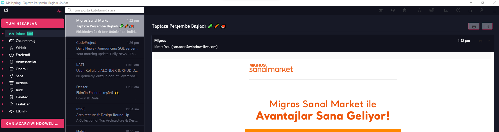

# Mailspring Monokai Theme

A theme for [Mailspring](https://github.com/Foundry376/Mailspring) inspired by the [Monokai](https://github.com/can-acar/MailSpring-Monokai-Theme) theme.
A project for personal use.

## Installation
Clone this repository and copy all files to a sub-folder named `Monokai` in your Mailspring `packages` folder: `~/.config/Mailspring/packages/Monokai`.  
Restart Mailspsring and select the theme (`Edit -> Change Theme...`)
